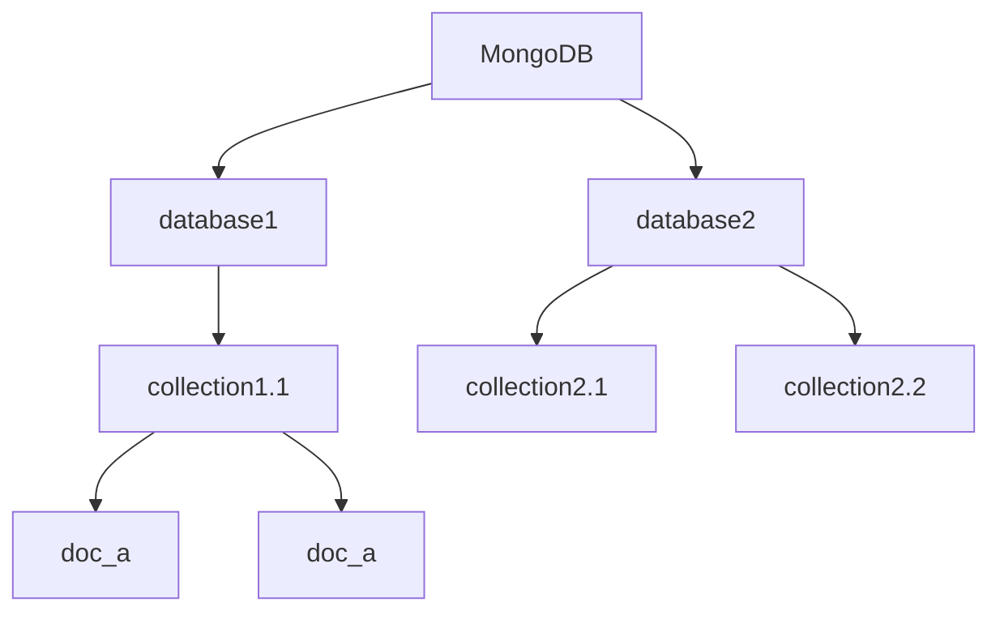

# MongoDB概述

---

MongoDB是一种NoSQL数据库，基于分布式文件存储。

## 安装

### 安装MongoDB

不多赘述。


* [在Ubuntu上安装](https://www.mongodb.com/docs/manual/tutorial/install-mongodb-on-ubuntu/#install-mongodb-community-edition)
* [在Windows上安装](https://www.mongodb.com/docs/manual/tutorial/install-mongodb-on-windows/#install-mongodb-community-edition)
* （推荐）使用Docker

````shell
docker pull mongodb/mongodb-community-server
docker run --name mongo -d mongodb/mongodb-community-server:latest
````

如果你在生产环境上Docker，别忘了挂载卷、开放端口 $27017$。

### 安装MongoDB Shell

mongosh 是mongo官方提供的mongo命令行管理工具，语法类似Javascript。（其实就是）

当然你可以使用其他的管理工具 (MongoDB Compass，IDE上的插件，etc.)

[参考](https://www.mongodb.com/docs/mongodb-shell/install/#procedure)

## CURD




MongoDB中有多个数据库，数据库中含有多个集合，数据以文档的形式存储在集合中。

文档的语法与JSON几乎完全一致。

举个例子
```json
use sample_mflix

db.movies.insertMany([
   {
      title: "Jurassic World: Fallen Kingdom",
      genres: [ "Action", "Sci-Fi" ],
      runtime: 130,
      rated: "PG-13",
      year: 2018,
      directors: [ "J. A. Bayona" ],
      cast: [ "Chris Pratt", "Bryce Dallas Howard", "Rafe Spall" ],
      type: "movie"
    },
    {
      title: "Tag",
      genres: [ "Comedy", "Action" ],
      runtime: 105,
      rated: "R",
      year: 2018,
      directors: [ "Jeff Tomsic" ],
      cast: [ "Annabelle Wallis", "Jeremy Renner", "Jon Hamm" ],
      type: "movie"
    }
])
```

当你插入一个文档的时候，MongoDB会向文档中插入一个field`_id`。这个被用于MongoDB内部的索引，不能乱动。

| db.collection. | 描述 |
| -------------- | ---- |
| insertMany()   |      |
| insertOne()    |      |
| insert()       |      |
|                |      |
|                |      |
|                |      |
|                |      |
|                |      |

